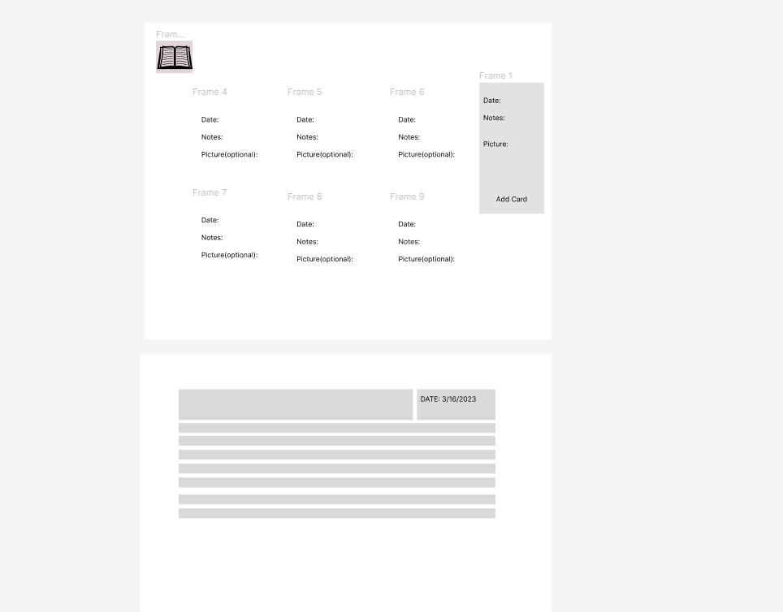

## Diary APP
This is a simple diary app that allows users to create and manage their personal diary entries. It is designed for users who want to keep a daily log of their thoughts, ideas, and experiences.
## Backend Link
https://diary-app.herokuapp.com/
## Features
- Create and save diary entries with a date and time stamp.
- Edit and delete existing entries.
- View all entries in a list or calendar view.
- Backup and Store your diary data using MongoDB and AWS 

### User Stories

- As a user I can create an entry
- As a user I can update an entry
- As a user I delete an entry

### Technologies Used:
- React
- MongoDB
- Express
- Node.js
- Redux
- Redux thunk
- Material UI
### Future Enhancements:
- Enhance styling
- Better UI
- Implement some type of API
- Improve the search function to include more advanced filters.
- Allow users to share their entries via social media or email.
## Credits
This app was created by Kevin Tran as a personal project.